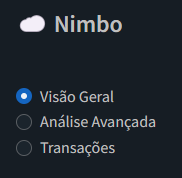
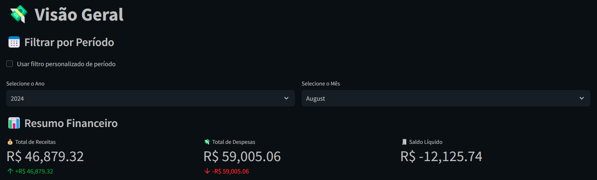
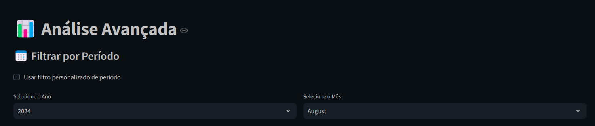
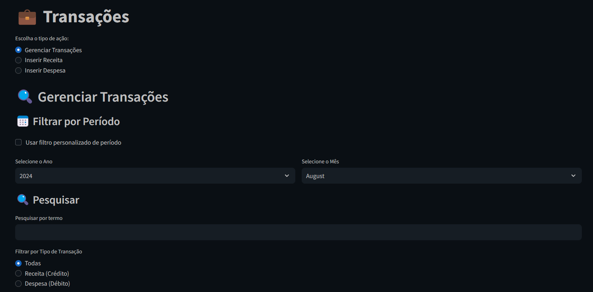
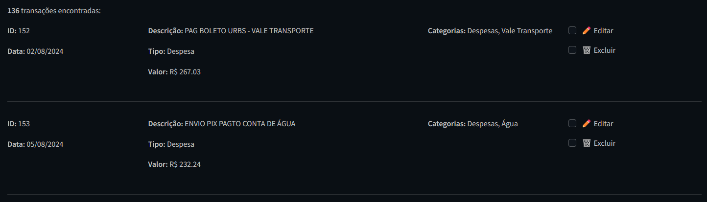
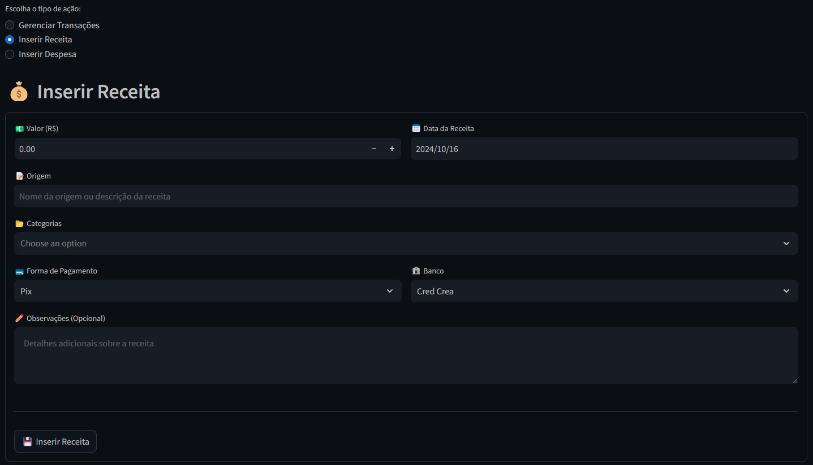
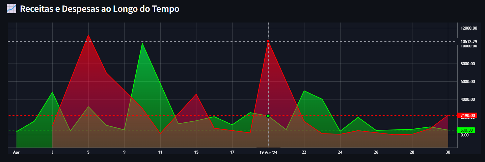
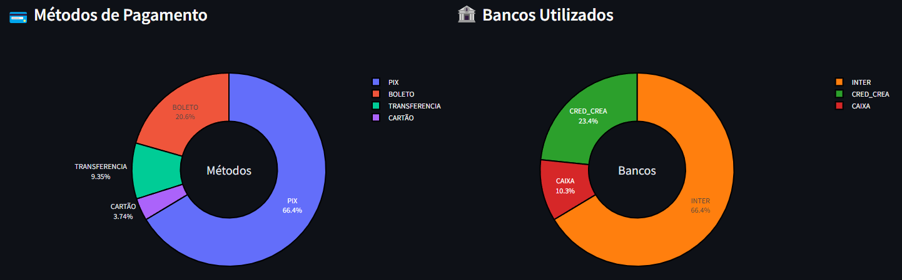

# ☁️ Nimbo

**Nimbo** é uma plataforma de gestão financeira desenvolvida para a [**Eceel-Tec**](https://eceel-tec.com.br/), uma empresa de assistência técnica, como parte da disciplina **Projetos 5** dos cursos de **Ciência da Computação** e **Design** da [**Cesar School**](https://cesar.school). O objetivo é facilitar o acompanhamento de **entradas** e **saídas**, além de oferecer **visualizações** e **análises avançadas** dos dados financeiros da empresa.

---

## 🚧 Status

Estamos atualmente na fase do **Status Report 1**, que foca nas seguintes atividades:

- Aquisição e análise inicial dos dados
- Definição de métricas de desempenho
- Criação das primeiras visualizações

O protótipo está em desenvolvimento, com as funcionalidades principais sendo testadas e refinadas.

---

## 🔍 Processo

Para definir as análises a serem realizadas, foi necessário documentar os dados registrados pela empresa. Descobrimos que os dados estavam distribuídos em cinco planilhas no Excel:

- **3 planilhas** contendo o histórico de transações (cada uma de um banco diferente)
- **1 planilha** agrupando todas as despesas com anotações adicionais
- **1 planilha** registrando o histórico de serviços prestados

Com base nessas planilhas, extraímos informações financeiras, incluindo:

- **Data**
- **Valor**
- **Banco** (referente à planilha)
- **Tipo de transação** (crédito/débito)
- **Detalhes descritivos** (método de pagamento, destinatário/remetente, descrição)

### 🗂 Estrutura Unificada de Dados

Após essa análise, decidimos criar uma estrutura única para consolidar os dados em um só lugar. A estrutura definida é a seguinte:

| Campo               | Descrição                                                    |
|---------------------|--------------------------------------------------------------|
| **ID**              | Identificador único da transação                             |
| **Data**            | Data da transação                                            |
| **Tipo**            | Tipo de transação (crédito/débito)                           |
| **Descrição**       | Texto descritivo da transação                                |
| **Método de Pagamento** | Meio utilizado na transação (PIX, cartão, dinheiro, etc.)   |
| **Banco**           | Banco onde a transação foi realizada                         |
| **Valor**           | Valor monetário da transação                                 |
| **Observações**     | Notas adicionais sobre a transação                           |
| **Categorias**      | Lista de categorias associadas à transação (serviço, compra, venda, etc.) |

Essa estrutura centralizada facilita a análise específica de cada transação e otimiza a visualização dos dados financeiros da empresa.

## 📊 Análises

Com a nova estrutura de dados estabelecida, definimos o **valor das transações** como a métrica principal e identificamos quais análises financeiras seriam mais úteis para a empresa. Concluímos que as seguintes análises seriam essenciais:

1. **Distribuição das despesas e receitas ao longo do tempo**  
   Utilizamos um gráfico de volumes sobrepostos, onde um volume representa as receitas e outro as despesas, permitindo uma comparação clara entre as duas categorias ao longo do tempo.

2. **Distribuição dos saldos diários**  
   Implementamos um gráfico de volume combinado com um histograma no mesmo eixo temporal, facilitando a visualização do saldo acumulado e das variações de cada dia, destacando picos e quedas.

3. **Distribuição dos métodos de pagamento**  
   Utilizamos um gráfico de **donut** para representar a distribuição em porcentagem dos métodos de pagamento utilizados (PIX, cartão, dinheiro, etc.), fornecendo uma visão clara das preferências de pagamento da empresa.

4. **Distribuição dos bancos utilizados nas transações**  
   Também aplicamos um gráfico de **donut** para ilustrar a distribuição dos bancos utilizados nas transações, destacando quais instituições financeiras são mais frequentes nas operações da empresa.

5. **Distribuição dos valores das transações por categoria**  
   Para essa análise, utilizamos quatro gráficos distintos:
   - Um **histograma emparelhado** (receitas e despesas) em função das categorias, destacando a frequência de transações em cada uma.
   - Dois **boxplots**, um para cada tipo de transação (receita e despesa), agrupados por categoria, mostrando a variação dos valores dentro de cada grupo.
   - Um gráfico de **sunburst**, que agrupa as categorias dentro dos tipos de transação (receita e despesa), exibindo a distribuição proporcional (%) de cada categoria, permitindo uma visão clara das proporções.

Essas visualizações oferecem insights valiosos sobre o comportamento financeiro da empresa, facilitando a tomada de decisões estratégicas.


**Próximos Passos:**
- Análise Aprofundada: Aplicação de técnicas de análise mais complexas, como análise multivariada, relacionando múltiplas variáveis para insights mais ricos.
- Dashboard Baseado em Métricas: Expansão do dashboard atual para incluir as métricas e indicadores definidos, apresentando uma visualização mais detalhada e informativa.
- Storytelling com Dados: Desenvolvimento de técnicas de apresentação para comunicar insights de forma clara e impactante, utilizando storytelling com os dados.


## Instalação e Execução
### Pré-requisitos
- **Python**
- **Streamlit** e outras bibliotecas listadas em `requirements.txt`.

### Instruções para Linux

- Clone o repositório:
   ```bash
   git clone https://github.com/pedro-coelho-dr/dash.git
   ```
   ```bash
   cd dash
   ```

- Crie e ative o ambiente virtual:   
  
    Linux:
   ```bash
   python3 -m venv venv
   ```
   ```bash
   source venv/bin/activate
   ```
    Windows:
   ```bash
   python -m venv venv
   ```
   ```bash
   venv\Scripts\activate
   ```

- Instale as dependências:
   ```bash
   pip install -r requirements.txt
   ```

 - Rode o app:
   ```bash
   streamlit run app.py
   ```
---

## Vídeo Demo

[](https://youtu.be/4o1jFVl1eh8)

## Como Usar

### Menu Principal  
Escolha entre as opções para gerenciar, inserir receitas ou despesas.



### Visão Geral  
Acompanhe um resumo financeiro com receitas, despesas e saldo líquido. Utilize filtros de período para refinar a visualização.



### Análise Avançada  
Explore gráficos detalhados sobre receitas e despesas, filtrando por ano e mês.



### Gerenciar Transações  
Pesquise, edite ou exclua transações. Utilize filtros de tipo, categoria e data para encontrar rapidamente o que precisa.





### Inserir Receita/Despesa  
Adicione novas transações com detalhes como valor, categoria, forma de pagamento, e banco.



## Análise e Visualização de Dados

### Receitas e Despesas ao Longo do Tempo
Gráfico de linha que mostra a variação de receitas (verde) e despesas (vermelho) ao longo das datas.



### Histórico de Saldo
Gráfico que exibe a evolução do saldo acumulado ao longo do tempo, calculado com base em receitas e despesas.


### Métodos de Pagamento e Bancos Utilizados
Gráficos donut quem representam a proporção de cada método de pagamento e bancos utilizados.



## Gráfico Sunburst (Porcentagens de Receita e Despesa por Categoria)
Mostra interativamente a distribuição de receitas e despesas por categorias, facilitando a visualização de quais categorias representam maiores porcentagens em cada tipo (Receita/Despesa).

.png)  


### Gráficos de Dispersão (Valor por Categoria)
Dois gráficos de dispersão, um para receitas e outro para despesas, que mostram o valor de cada transação por categoria, representando a magnitude com o tamanho dos pontos.

.png)

.png)

### Gráfico de Barras Sobrepostas (Receita e Despesa por Categoria)
Compara lado a lado as receitas e despesas por categorias, utilizando cores distintas para receitas (verde) e despesas (vermelho).

.png)


## Equipe

- Caio Hirata
- Camila Cirne
- Clara Wanderley
- Gabriela Viana
- Leo Kaiser
- Pedro Coelho
- Virna Amaral
- Yara Rodrigues

## Devs
<table>
  <tr>
    <td align="center">
      <a href="https://github.com/Kal-0">
        <br>
        <sub>
          <b>Caio Cesar</b>
        </sub>
      </a>
    </td>
    <td align="center">
      <a href="https://github.com/camilacirne">
        <br>
        <sub>
          <b>Camila Cirne</b>
        </sub>
      </a>
    </td>
     <td align="center">
      <a href="https://github.com/pedro-coelho-dr">
        <br>
        <sub>
          <b>Pedro Coelho</b>
        </sub>
      </a>
    </td>
     <td align="center">
      <a href="https://github.com/virnaamaral">
        <br>
        <sub>
          <b>Virna Amaral</b>
        </sub>
      </a>
    </td>
     <td align="center">
      <a href="https://github.com/Yara-R">
        <br>
        <sub>
          <b>Yara Rodrigues</b>
        </sub>
      </a>
    </td>
  </table>
