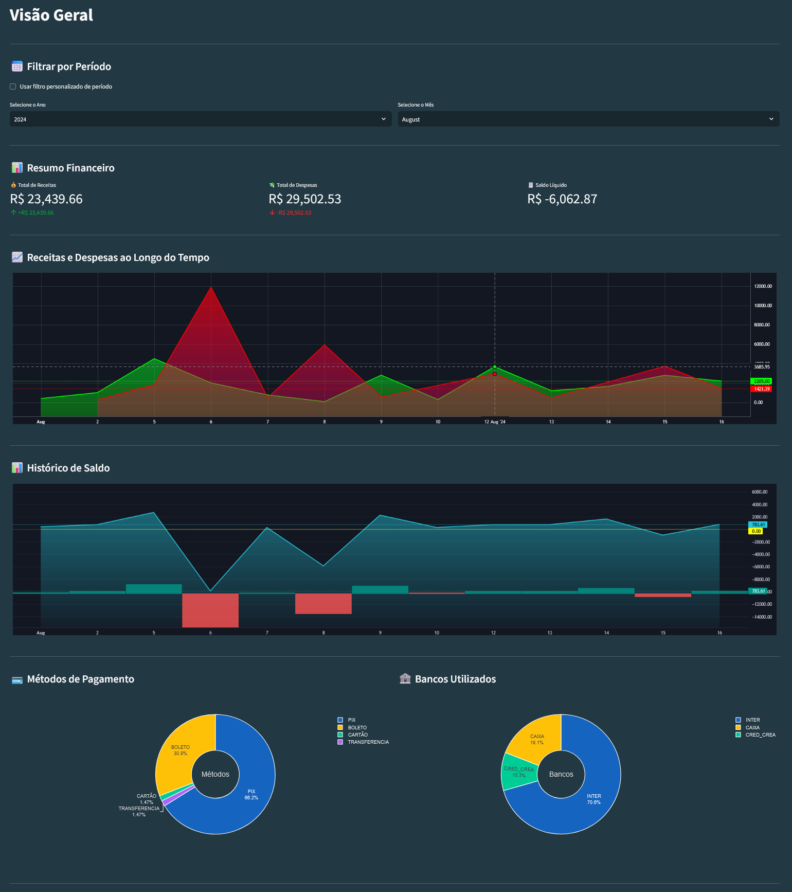
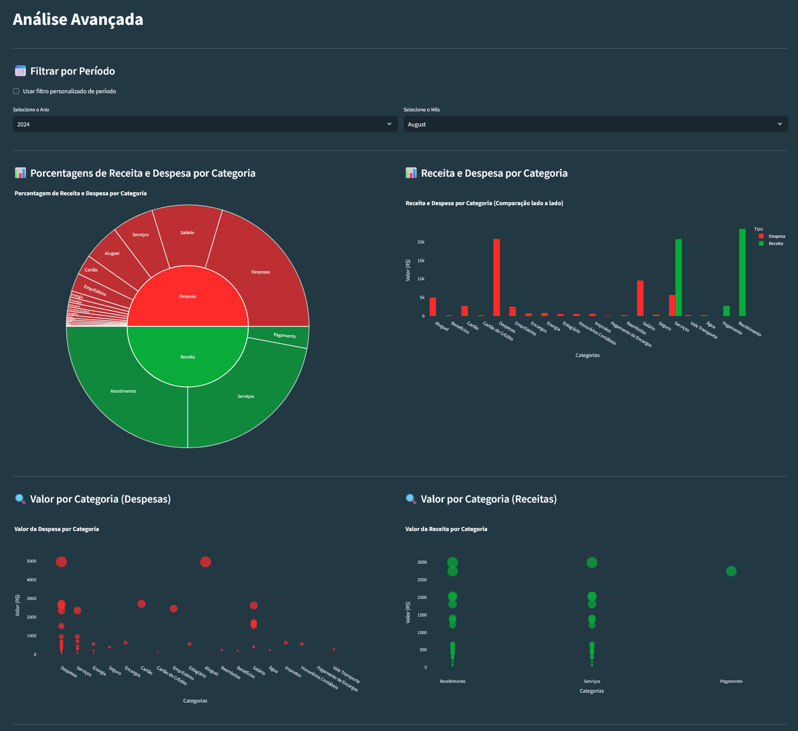
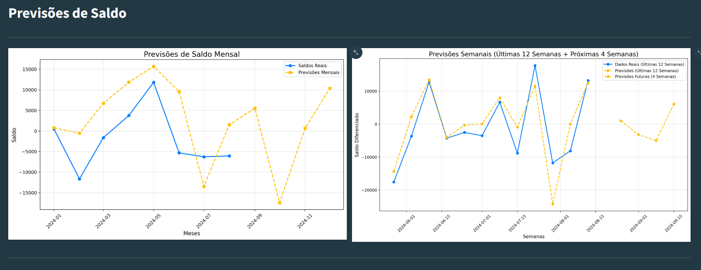
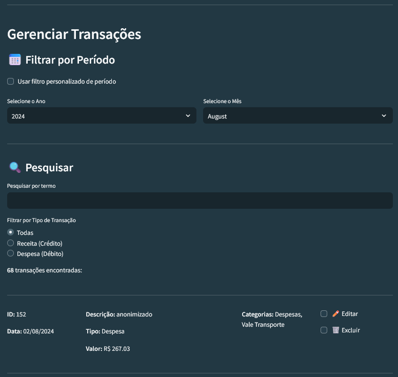
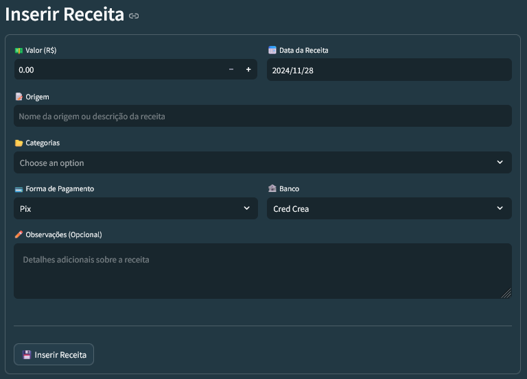

# Dash

**Dash** é uma plataforma de gestão financeira desenvolvida para a [**Eceel-Tec**](https://eceel-tec.com.br/), uma empresa de assistência técnica, como parte da disciplina **Projetos 5** dos cursos de **Ciência da Computação** e **Design** da [**Cesar School**](https://cesar.school). O objetivo é facilitar o acompanhamento de **receitas** e **despesas**, além de oferecer **visualizações**, **análises avançadas** e **previsões** dos dados financeiros da empresa.

## Tabela de Conteúdos
1. [Dados](#dados)
2. [Funcionalidades](#funcionalidades)
3. [Previsões](#previsões)
4. [Interface e Visualizações](#interface-e-visualizações)
5. [Instalação e Execução](#instalação-e-execução)
6. [Equipe](#equipe)

## Dados
### Origem e Anonimização
Os dados foram coletados de diversas planilhas Excel fornecidas pela empresa, que continham histórico de transações. Todas as informações sensíveis foram anonimizadas. Os dados foram consolidados em um banco de dados SQLite, permitindo consultas eficientes e flexíveis.


### Estrutura Consolidada

A estrutura dos dados foi padronizada para incluir campos essenciais, como:

| Campo               | Descrição                                                    |
|---------------------|--------------------------------------------------------------|
| **ID**              | Identificador único da transação                             |
| **Data**            | Data da transação                                            |
| **Tipo**            | Tipo de transação (crédito/débito)                           |
| **Descrição**       | Texto descritivo da transação                                |
| **Método de Pagamento** | Meio utilizado na transação (PIX, cartão, dinheiro, etc.)   |
| **Banco**           | Banco onde a transação foi realizada                         |
| **Valor**           | Valor monetário da transação                                 |
| **Categorias**      | Lista de categorias associadas à transação                   |


## Funcionalidades
1. **Gerenciamento de Receitas e Despesas**
   - Inserção, edição e remoção de transações financeiras diretamente pela interface.
   - Busca e filtragem de transações.
2. **Análise e Visualização de Dados**
   - Gráficos interativos para análises por receitas e despesas, categorias, bancos e métodos de pagamento.
3. **Previsões de Saldos**
   - Projeções mensais e semanais baseadas em modelos de séries temporais (SARIMA).


## Interface e Visualizações

A interface do sistema é composta por quatro seções que permitem aos usuários gerenciar e visualizar dados financeiros de forma interativa.

### Visão Geral
Esta seção apresenta um resumo financeiro consolidado, permitindo uma visão clara da situação atual:

- Indicadores Financeiros:
  - Total de Receitas, Total de Despesas e Saldo Líquido.
- Gráficos de Linhas:
  - Histórico de receitas e despesas ao longo do tempo.
  - Evolução do saldo acumulado.
- Gráficos de Pizza (Donut):
  - Distribuição dos métodos de pagamento (PIX, cartão, etc.).
  - Distribuição dos bancos utilizados nas transações.



### Análise Avançada
Focada em análises mais detalhadas e interativas:

- Gráfico Sunburst:
  - Visualiza a distribuição proporcional de receitas e despesas por categorias.
- Gráfico de Barras:
  - Compara receitas e despesas lado a lado em cada categoria.
- Gráficos de Dispersão:
  - Apresenta variações de valores por categoria, separando receitas e despesas para melhor análise.



### Previsões
Apresenta projeções financeiras baseadas em modelos de séries temporais (SARIMA):

- Previsão Mensal:
  - Mostra as tendências de saldo para os próximos 12 meses, com gráficos que destacam dados reais e previstos.
- Previsão Semanal:
  - Exibe projeções para as próximas 4 semanas, com detalhamento de diferenças semanais e validação visual por meio de gráficos.
  


### Transações
Oferece funcionalidades para gerenciar os dados financeiros:

- Gerenciar Transações:
  - Permite buscar, editar ou excluir transações existentes.
- Inserir Receita:
  - Formulário dedicado para adicionar receitas.
- Inserir Despesa:
  - Formulário para registrar despesas.




### Vídeo-demo

## Previsões
### Modelagem
As previsões financeiras foram feitas utilizando o modelo SARIMA, que é ideal para dados com padrões sazonais e temporais. A modelagem foi aplicada aos saldos mensais e semanais das transações, considerando:

Dados de treino:

- Mensal: 2 anos de dados de treino, 8 meses de teste e 4 meses de previsão.

- Semanal: 2 anos de dados de treino, 12 semanas de teste e 4 semanas de previsão, com aplicação de diferenciação para estabilizar a série temporal.

Para mais detalhes sobre a modelagem e exploração dos dados, acesse [exploration.ipynb](exploration/exploration.ipynb)

### Limitações
Embora os modelos sejam funcionais, existem limitações:

- Qualidade dos Dados: Dados heterogêneos podem introduzir imprecisões.

- Validação Limitada: Modelos mais robustos poderiam oferecer maior precisão.

### Gráficos
1. **Previsão Mensal**: Exibe os saldos reais e previstos ao longo dos meses.
    

2. **Previsão Semanal**: Mostra a projeção das próximas semanas.
    


## Instalação e Execução
### Requisitos
- **Python**
- **Streamlit** e outras bibliotecas listadas em `requirements.txt`

### Instruções

- Clone o repositório:
   ```bash
   git clone https://github.com/pedro-coelho-dr/dash.git
   ```
   ```bash
   cd dash
   ```

- Crie e ative o ambiente virtual:
   ```bash
   python3 -m venv venv
   source venv/bin/activate
   ```

- Instale as dependências:
   ```bash
   pip install -r requirements.txt
   ```

- Popule o banco de dados (se necessário):
   ```bash
   python database/seed_data.py
   ```

- Execute o aplicativo:
   ```bash
   streamlit run app.py
   ```


## Equipe
- **Caio Hirata**
- **Camila Cirne**
- **Clara Wanderley**
- **Gabriela Viana**
- **Leo Kaiser**
- **Pedro Coelho**
- **Virna Amaral**
- **Yara Rodrigues**

